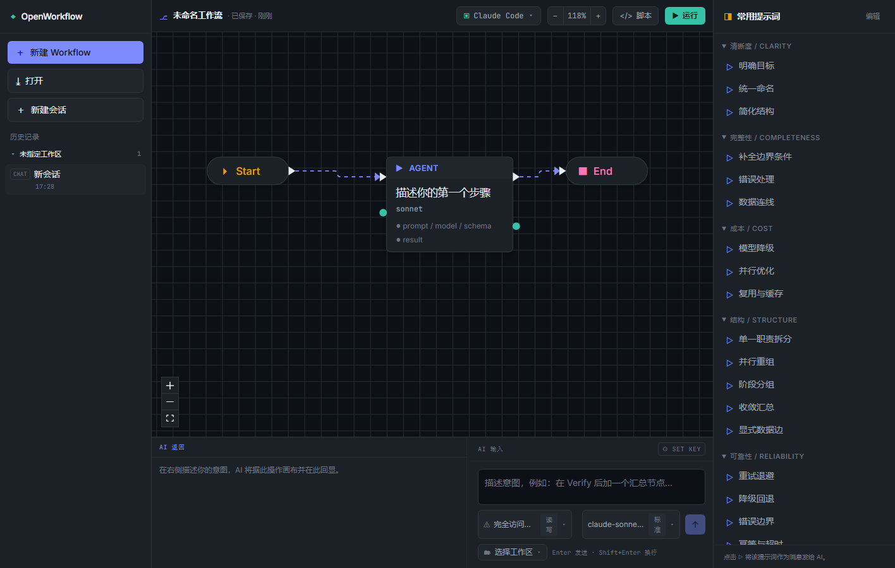

# OpenWorkflow

OpenWorkflow is a Tauri desktop editor for AI workflow graphs. It lets you design workflows visually, inspect node-level settings, run them locally, and compile the same IR into executable Claude Code-style scripts.



## Why OpenWorkflow

- Visual workflow authoring instead of hand-editing large scripts.
- One IR shared by the canvas, parser, emitter, and history system.
- Multiple runtime adapters, including Claude Code, Codex, and Gemini.
- Node-level editing for prompts, models, schemas, and other parameters.
- A reusable prompt library with common workflow rewrites and review prompts.
- Workspace and session history so you can return to earlier work quickly.
- Run/stop controls with per-node execution state on the canvas.
- Local API key storage for browser-side AI assist, kept on the machine only.

## Quick Start

```bash
cd app
npm install
npm run dev
```

For the desktop app:

```bash
cd app
npm run desktop
```

For a Windows release package:

```bash
cd app
npm run package
```

From the repository root, `run.bat` launches the app and rebuilds when needed, and `build.bat` packages the Windows installer.

## Basic Usage

1. Create a new workflow or open an existing one.
2. Pick a runtime adapter and adjust the node model if needed.
3. Select a node on the canvas to edit its prompt and parameters.
4. Use the prompt panel to apply common edits such as clarity, completeness, cost, reliability, and rollback-oriented fixes.
5. Run the workflow, watch node status updates, and stop at any time.
6. Switch sessions or workspaces from the history rail to continue earlier work.

## Project Layout

```text
app/
  src/                 React + TypeScript frontend
    core/              IR, parser, emitter, round-trip logic
    canvas/            React Flow canvas and node components
    panels/            Sidebar, prompt panel, AI dock
    store/             Zustand application state
  src-tauri/           Rust/Tauri desktop backend and packaging config
docs/                  Design and workflow references
pencil/                Pencil design files
run.bat                Build-if-needed and launch the Windows app
build.bat              Build the Windows installer
```

## More Docs

- [Chinese README](README.zh-CN.md)
- [Workflow syntax reference](docs/workflow-syntax-reference.html)
- [Design notes](docs/design.html)

## Verification

```bash
cd app
npm run typecheck
npm run lint
npm run package
```

## License

No license has been specified yet.
