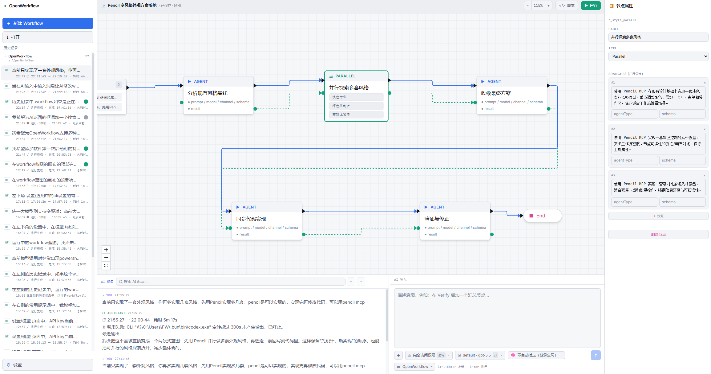

# OpenWorkflows

<div align="center">
  <a href="../../README.md">English</a> | 中文 | <a href="README.fr.md">Français</a> | <a href="README.de.md">Deutsch</a> | <a href="README.es.md">Español</a> | <a href="README.pt-BR.md">Português</a> | <a href="README.ru.md">Русский</a> | <a href="README.ja.md">日本語</a> | <a href="README.ko.md">한국어</a> | <a href="README.hi.md">हिन्दी</a> | <a href="README.ar.md">العربية</a>
</div>

OpenWorkflows 是一个桌面应用，集成了免费大模型聊天和可视化多智能体工作流编辑。你可以用 17+ 个免费渠道（Gemini、DeepSeek、Groq、Ollama……）直接对话，也可以在画布上编排多智能体工作流，编译成 Claude Code、Codex、Gemini 等运行时可执行脚本。

<p align="center">
  
</p>

## 主要功能

### 🧊 免费大模型聊天
- **17+ 个免费渠道**内置——NVIDIA NIM、OpenRouter、Google Gemini、DeepSeek、Mistral、Groq、Cerebras、Fireworks、Kimi、Z.ai、OpenCode、Wafer，以及本地运行时（Ollama、LM Studio、llama.cpp）。
- 内置 Rust 反代自动翻译 Anthropic 和 OpenAI 协议，所有渠道共用同一聊天界面。
- 选一个渠道，粘贴 API Key，直接开始聊天——无需额外配置。
- 本地运行时（Ollama、LM Studio、llama.cpp）**零 API Key** 即可使用。

### 🕸️ 可视化工作流编辑
- 在右下角 AI 输入框描述需求，自动生成可编辑的 Workflow 蓝图。
- 用画布替代手写大段多智能体脚本，工作流结构一眼可见。
- 编译蓝图为可运行的 Claude Code 风格 Workflow 脚本，支持脚本→蓝图往返恢复。
- 选择 Claude Code、Codex、Gemini 等运行时适配器，每个节点单独配置模型。
- 运行时显示节点级状态，支持随时停止。

### ⭐ 收藏与历史
- 星标任意会话，收藏到侧边栏 **收藏** 标签页，随时快速访问。
- **历史** 标签页显示所有会话，带 **CHAT**（聊天）和 **WF**（工作流）徽章区分。
- 完整的工作区和会话历史，切换上下文不丢失进度。

### 🔒 本地优先
- API Key 只保存在本机，不发送到任何服务器。
- 所有工作流数据、会话和设置都保存在本机。

## 使用教程

- [OpenWorkflows 使用教程](claude-code-workflow-openworkflow.md) - 按截图顺序讲清从通用设置、AI 输入框运行时选择，到蓝图生成、运行和界面风格切换的完整流程。

## 快速开始

```bash
cd app
npm install
npm run dev
```

桌面端开发模式：

```bash
cd app
npm run desktop
```

打 Windows 安装包：

```bash
cd app
npm run package
```

在仓库根目录下，也可以直接使用 `run.bat` 启动应用，或用 `build.bat` 打包 Windows 安装器。

## 使用方式

### 聊天模式

1. 点击侧边栏 **+ 新会话**。
2. 选择一个免费渠道（如 Gemini、DeepSeek、Ollama）或用自己的 API Key 接入任意运行时。
3. 在底部输入框提问，上方返回区实时显示回答。
4. 星标会话可收藏到 **收藏** 标签页。

### 工作流模式

1. 点击侧边栏 **+ 新工作流**。
2. 在右下角 AI 输入框描述需求，OpenWorkflows 自动生成 Workflow 蓝图。
3. 继续在 AI 输入框补充要求，或点击右侧常用提示词，持续优化结构、完整性、成本、回退等方向。
4. 必要时选中节点，手动修改提示词、模型、schema 和执行参数。
5. 选择 Claude Code、Codex、Gemini 等运行时适配器。
6. 点击顶部运行按钮执行工作流，查看节点级状态。

## 项目结构

```text
app/
  src/                 React + TypeScript 前端
    core/              IR、解析器、生成器、往返校验逻辑
    canvas/            React Flow 画布和节点组件
    panels/            Sidebar（历史 + 收藏）、提示词面板、AI 面板（聊天 + 工作流）、设置（免费渠道）
    runtime/           DAG 执行、provider gateway、运行状态
    store/             Zustand 应用状态
    lib/
      freeChannels.ts  17+ 免费渠道目录 + 辅助函数
  src-tauri/
    src/
      free_proxy.rs    Rust 反代 + Anthropic↔OpenAI 协议翻译
      lib.rs           Tauri 命令、文件系统/历史桥接
  doc/                 使用教程和截图
pencil/                Pencil 设计文件
run.bat                自动重建并启动 Windows 应用
build.bat              打包 Windows 安装包
```

## 相关文档

- [英文版](../../README.md)
- [英文使用教程](claude-code-workflow-openworkflow.en.md)

## 验证方式

```bash
cd app
npm run typecheck
npm run lint
npm run package
```

## 许可证

目前尚未指定许可证。
