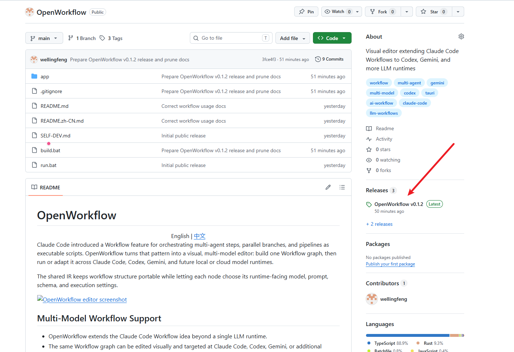
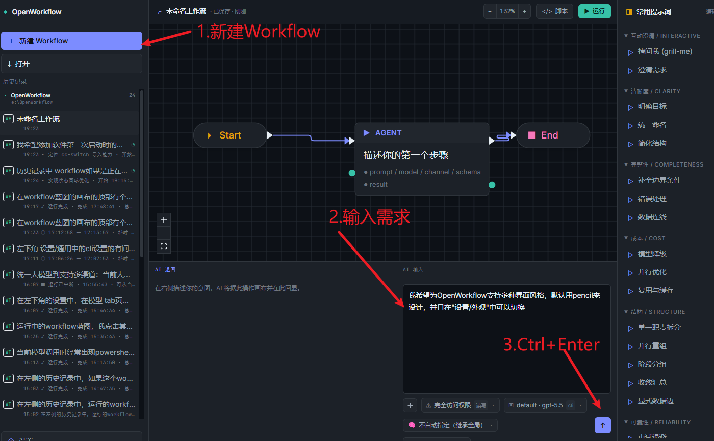
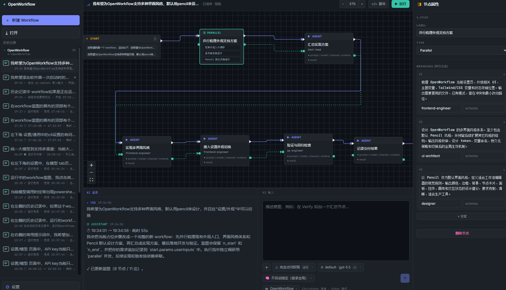
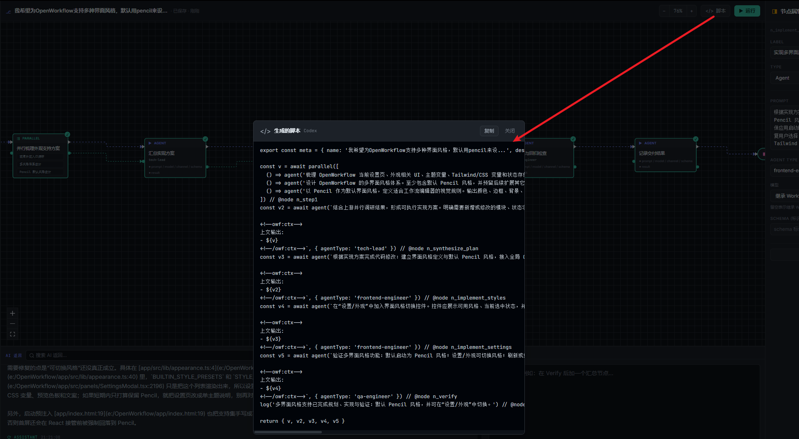
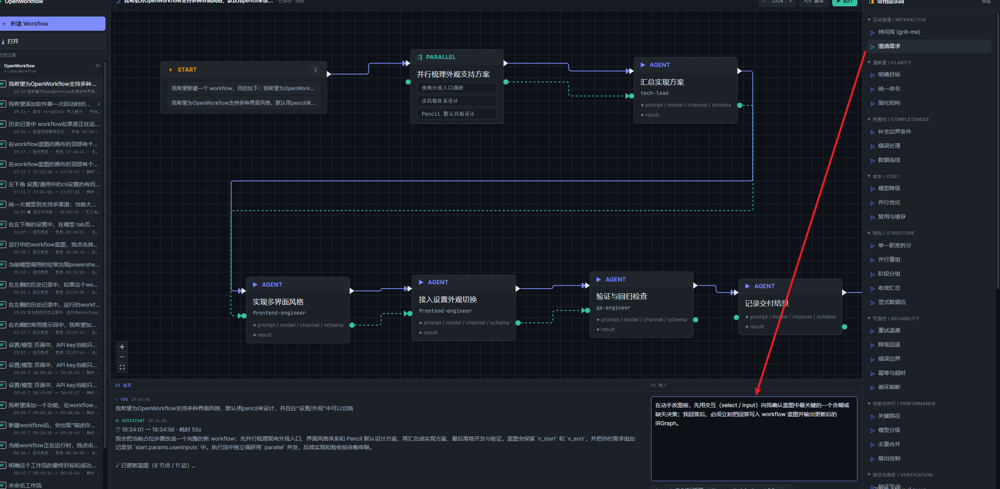
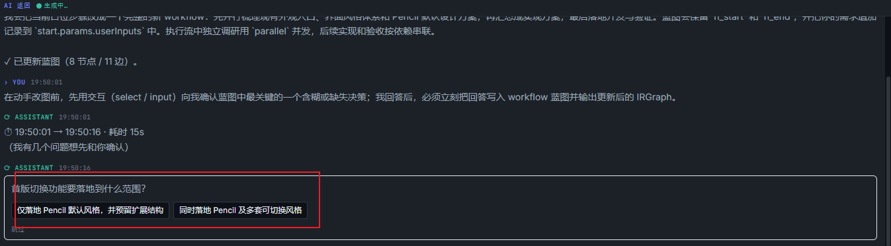
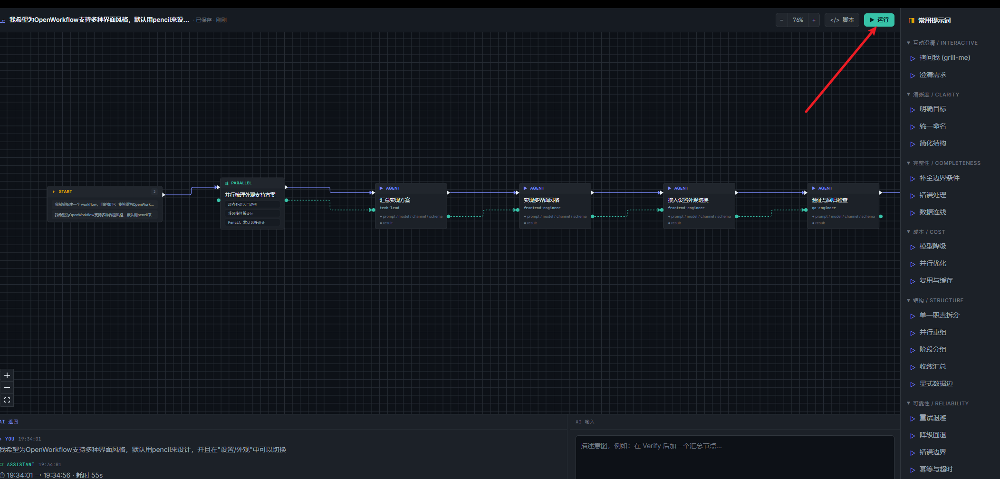
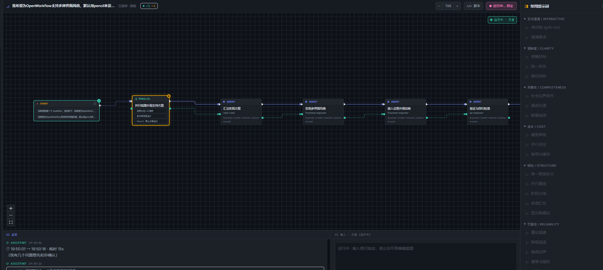
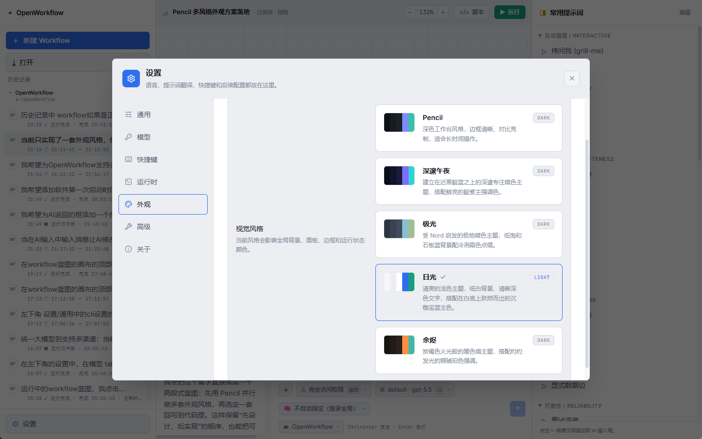

# Claude Code ya tiene Dynamic Workflows. ¿Y los demás modelos? Una alternativa open source: OpenWorkflows

## Últimamente he estado mirando los nuevos dynamic workflows de Claude Code. Comparado con MCP, Skill y Hooks, casi nadie habla de esta nueva función. A continuación los llamaré simplemente workflows.

Para tareas complejas, mucha gente antes prefería escribir primero un HTML de investigación, convertirlo después en un HTML de plan técnico y finalmente entregárselo a la IA para desarrollar. Pero muchas veces el resultado no era bueno. La razón principal es que HTML es texto para humanos. No es un script y carece de información estructurada. La consistencia del orden, el nivel de paralelismo, si los límites están claros, cómo se dividen las tareas y cómo intercambian información entre ellas quedan poco definidos, así que la IA termina adivinando demasiado.

Los workflows son scripts en sí mismos, y eso puede resolver este problema de raíz.

Además, los workflows permiten exploración desde varias perspectivas, validación adversarial y votación de planes. Por eso suelen ser más precisos. Ganan por escala: cinco agents trabajan al mismo tiempo sobre el mismo problema y luego otro agent resume los resultados. Es más preciso, aunque también consume tokens a gran velocidad.

Si es algo tan general, ¿por qué debería estar atado a un solo modelo o a una sola CLI?

Siguiendo esa idea, desarrollé OpenWorkflows, o más exactamente, lo desarrolló la IA. Convierte workflows del estilo de Claude Code en un lienzo visual e intenta hacer que el mismo flujo pueda apuntar a Claude Code, Codex, Gemini y más runtimes locales o en la nube.

Esta vez no voy a hablar de conceptos abstractos. Voy a seguir directamente las capturas. El ejemplo es concreto: hacer que OpenWorkflows admita varios estilos de interfaz, use Pencil por defecto y permita cambiarlos en Configuración / Apariencia.

Durante el desarrollo intenté trabajar dentro de OpenWorkflows tanto como fuera posible, para que pudiera autoarrancarse.

El siguiente proceso usa CodeX como modelo grande predeterminado para el desarrollo.

### 0. Primero, la interfaz final

<p align="center">
  
</p>

La interfaz principal de OpenWorkflows muestra el blueprint de workflows en el centro, las propiedades de los nodos a la derecha y la entrada y salida de IA en la parte inferior.

La interfaz se divide aproximadamente en cuatro partes: historial de workflows a la izquierda, lienzo visual en el centro, propiedades de nodos y prompts comunes a la derecha, y entrada de IA con respuestas en la parte inferior.

### 1. Descargar OpenWorkflows

<p align="center">
  
</p>

Encuentra la versión más reciente en Releases, en el lado derecho de la página del proyecto en GitHub.

### 2. Configura primero el modelo grande

Por defecto se usará la CLI ya configurada en el sistema para iniciar. Puedes usar herramientas como CC-Switch para configurarla.

### 3. Crear workflows nuevos e introducir la necesidad

<p align="center">
  
</p>

Después de configurar el modelo, haz clic en "Nuevo workflows" a la izquierda. En el lienzo aparecerá una estructura mínima: Start, un Agent y End.

No hace falta dibujar los nodos manualmente. El punto de partida real es el cuadro de entrada de IA en la esquina inferior derecha. En este ejemplo escribí:

```text
Quiero que OpenWorkflows admita varios estilos de interfaz,
use Pencil como diseño predeterminado
y permita cambiarlos en Configuración / Apariencia.
```

Después puedes pulsar Ctrl+Enter o hacer clic en el botón de envío de la esquina inferior derecha. OpenWorkflows convierte ese lenguaje natural en un blueprint de workflows editable.

### 4-1. Generar el blueprint de workflows

<p align="center">
  
</p>

Tras enviar la necesidad, OpenWorkflows primero reorganiza el paso actual en un workflow completo.

El blueprint de la captura es aproximadamente así:

```text
Start
  -> Explorar en paralelo el soporte de apariencia
      -> Investigar las entradas de apariencia existentes
      -> Diseñar el sistema multiestilo
      -> Diseñar el estilo Pencil predeterminado
  -> Resumir el plan de implementación
  -> Implementar varios estilos de interfaz
  -> Conectar el cambio en Configuración / Apariencia
  -> Validar y revisar regresiones
  -> Registrar el resultado de entrega
  -> End
```

En el panel derecho de propiedades puedes seguir modificando las propiedades del nodo seleccionado. Aun así, muchas veces es mejor usar el cuadro inferior y dejar que la IA modifique los nodos del blueprint para iterar continuamente.

### 4-2. Ver el script generado

<p align="center">
  
</p>

En la parte superior hay una entrada llamada "Script". Al abrirla aparece el script generado a partir del blueprint actual.

En la captura se ven estructuras como parallel(...) y agent(...). Los nodos paralelos se convierten en ramas que se ejecutan de forma concurrente, y los nodos normales se convierten en llamadas individuales a agents.

Esto también muestra que OpenWorkflows no es solo dibujar cajas. Detrás del lienzo hay una estructura unificada de workflows, y por eso después puede conectarse a distintos runtimes.

### 5. Seguir modificando con prompts comunes a la derecha

<p align="center">
  
</p>

Después de generar el blueprint no hace falta ejecutarlo de inmediato. El panel de "Prompts comunes" de la derecha es más adecuado para pulir el proceso, aunque también puedes escribir tus propios prompts.

Los prompts están agrupados por escenario: aclaración interactiva, claridad, completitud, coste, estructura, fiabilidad, rendimiento y paralelismo, verificación y pruebas.

En la captura se usa "Aclarar requisitos". Este prompt rellena la entrada de IA y pide que, antes de modificar el blueprint, la IA confirme interactivamente los puntos ambiguos clave.

Este diseño es muy práctico. Muchos workflows fallan no porque el modelo no pueda hacer la tarea, sino porque el objetivo, los límites, las rutas de fallo y la estrategia de coste no estaban claros desde el principio.

También hay prompts habituales como grill-me, completar condiciones límite, optimización paralela y principio único. Puedes añadir o modificar prompts por tu cuenta.

### 6. Confirmar límites con opciones interactivas

<p align="center">
  
</p>

Después de hacer clic en "Aclarar requisitos", la IA no cambia el gráfico directamente. Primero pregunta: "¿Hasta qué alcance debe aterrizar la función de cambio de estilo de interfaz?"

La captura ofrece dos opciones: implementar solo el estilo Pencil predeterminado y dejar una estructura extensible, o implementar Pencil junto con varios estilos conmutables.

Después de elegir, la IA escribe esa decisión de vuelta en el blueprint de workflows y emite el IRGraph actualizado. Este paso reduce el problema de que la IA cambie de dirección por su cuenta.

### 7. Hacer clic en Ejecutar

<p align="center">
  
</p>

Cuando la estructura del blueprint, la configuración del modelo y los límites clave estén confirmados, haz clic en "Ejecutar" en la parte superior.

Conviene no ejecutar el blueprint justo después de generarlo. Primero revisa si las ramas paralelas tienen sentido, si el nodo de resumen está después de las ramas paralelas y si la validación cubre el resultado final.

Si un nodo solo tiene una responsabilidad poco clara, puedes modificarlo primero en las propiedades del nodo y luego volver a ejecutar.

### 8. Observar el estado de ejecución

<p align="center">
  
</p>

Después de ejecutar, el botón superior cambia a "Ejecutando... Detener". La entrada de IA inferior queda bloqueada para evitar que el blueprint se desordene durante la ejecución.

El lienzo muestra el estado de los nodos. En la captura, Start ya terminó, el nodo paralelo siguiente se está ejecutando y en la esquina superior derecha aparece el contador de ejecución. Si algo falla en medio, se puede continuar desde la tarea anterior.

### 9. Cambiar el estilo de interfaz

<p align="center">
  
</p>

Cuando OpenWorkflows termina el desarrollo, reinicia el programa y cambia entre distintos estilos en Configuración / Apariencia.

En la captura se ven tarjetas de estilo como Pencil, Deep Night, Aurora, Daylight y Ember. Al elegir una, cambian el fondo global, los paneles, los bordes y los colores de estado de ejecución.

### Lo que me parece realmente útil

Lo más valioso de OpenWorkflows no es envolver un prompt con una UI.

Conecta "necesidad -> blueprint -> script -> ejecución -> revisión del historial". Puedes generar primero un proceso con lenguaje natural, revisar la estructura en el lienzo, usar prompts comunes para completar límites cuando haga falta y solo entonces ejecutar.

Un mismo conjunto de workflows tampoco tiene que estar ligado a un solo modelo. Los nodos sencillos pueden usar modelos baratos, los nodos clave pueden usar modelos más potentes y el destino de ejecución puede seguir ampliándose a Claude Code, Codex, Gemini u otros runtimes.

Para tareas complejas de programación con IA, esta forma de descomponer es más fácil de mantener que un prompt enorme. Si falla un nodo, se corrige ese nodo. Si una rama no hace falta, se elimina. Si quieres reutilizar algo, continúas desde el historial.

### Todavía es pronto, pero la dirección vale la pena

El concepto completo de workflows aún está en una etapa temprana, y OpenWorkflows también acaba de empezar. Los adaptadores de runtime, las capacidades de nodos y el ecosistema de scripts seguirán cambiando.

Pero la dirección general está clara: la programación con IA no se quedará para siempre en "abrir una ventana de chat y empujar manualmente cada paso".

Las tareas complejas terminarán convirtiéndose en workflows porque se pueden ver, editar, migrar y reutilizar.

### Extra: ¿no quieres abrir la interfaz? En la línea de comandos bastan dos comandos

Todo lo anterior está pensado para la interfaz gráfica. Pero hay muchos escenarios en los que el lienzo sobra: por ejemplo, cuando quieres enchufar un proceso en CI, meterlo en un script o ejecutarlo headless en un servidor. Por eso OpenWorkflows también ofrece una versión de línea de comandos, expuesta a través del skill `/openworkflows`.

En el diseño quise dejarla deliberadamente contenida: **del lado del usuario solo hay dos comandos**. Porque en la terminal no necesitas preocuparte por blueprints, IRGraph ni compilación, todos esos conceptos intermedios; **un workflow, para ti, es simplemente un script `.js`** y el resto de la conversión ocurre de forma automática.

```bash
owf gen "crea un flujo de revisión de código" -o review.js   # genera un script de workflow a partir de una frase
owf gen review.js "añade además un nodo de revisión de seguridad"      # modifica un script existente con una frase
owf run review.js                          # ejecuta el script
```

Y nada más (en realidad son solo dos comandos: `gen` y `run`).

**`owf gen`** sirve para generar o modificar workflows con lenguaje natural. Es exactamente la misma capacidad que ofrece el cuadro de entrada de IA en la parte inferior de la interfaz: tú describes lo que necesitas y genera el script; señalas un script existente y le explicas cómo cambiarlo, y lo cambia por ti.

Y aquí hay un punto clave: **no requiere configuración, no tienes que rellenar ninguna API Key**. Porque reutiliza la CLI `claude` que ya tienes autenticada en tu máquina (es la misma ruta que usa el runtime), así que mientras tengas claude instalado y la sesión iniciada, `owf gen` funciona directamente. Si no lo tienes, te recordará que primero hagas `claude login`.

**`owf run`** simplemente lanza el script, ejecuta nodo por nodo y va imprimiendo el progreso en tiempo real en la terminal:

```text
[14:32:02] ▶ agent n_scan
[14:32:15] ✓ agent n_scan — 13,2 s
[14:32:15] ▶ parallel n_review (3 ramas)
[14:32:31] ✓ parallel n_review — 16,1 s
Hecho — 29,8 s
```

El paralelismo, la ejecución en pipeline, la validación adversarial y los reintentos automáticos funcionan exactamente igual que al pulsar "Ejecutar" en la interfaz, porque **la línea de comandos y la interfaz comparten el mismo núcleo de ejecución**; lo único que cambia es que una pinta el resultado en el lienzo y la otra lo vuelca en la terminal.

Algunos flags habituales: `--dry-run` para hacer una comprobación previa sin ejecutar de verdad (ahorra tokens), `--resume` para retomar la ejecución desde el nodo donde falló la última vez, `--model` para indicar el modelo y `--json` para emitir una salida legible por máquina, perfecta para encadenar en un pipeline.

Una frase para resumir el reparto de papeles de esta CLI: **la interfaz se encarga de "verlo y editarlo", la línea de comandos se encarga de "ejecutarlo rápido y conectarlo", pero detrás hay un único workflow.**

Grupo QQ: 149523963

Proyecto:

https://github.com/wellingfeng/OpenWorkflows

Referencia:

https://code.claude.com/docs/en/workflows
